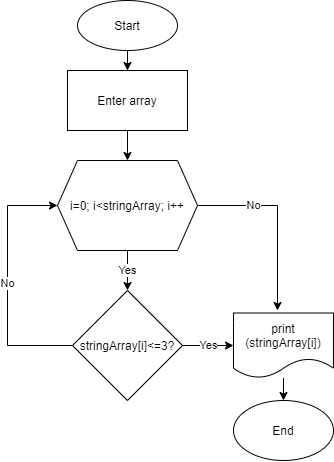

# ИТОГОВАЯ КОНТРОЛЬНАЯ РАБОТА

## Задачи

### 1. Создать репозиторий на GitHub

### 2. Нарисовать блок-схему алгоритма

### 3. Снабдить репозиторий оформленным текстовым описанием решения

+ 1-4 строки: описание условия задачи.

+ 6 строка: избавились от необходимости каждый раз писать Console.

+ 7 строка: очищаем терминал с каждым запуском.

+ 10 строка: инструкция ввода для пользователя.

+ 11 строка: для считывания введенного массива.

+ 12 строка: добавляем сепаратор.

+ 14-20 строки: используем циклы **for** и **if** с необходимыми условиями.

### 4. Написать программу, решающую поставленную задачу

using static System.Console;

Clear();

WriteLine("Введите массив через пробел: ");

string array = ReadLine()!;

string[] stringArray = array.Split(" ");

for (int i = 0; i < stringArray.Length; i++)

{

    if (stringArray[i].Length <= 3)

    {

        Write($"{stringArray[i]} ");

    }

}

### 5. Использовать контроль версий в работе

**Задача:** Написать программу, которая из имеющегося из массива строк формирует массив из строк, длина которых меньше либо равна 3 символа. Первоначальный массив можно ввести с клавиатуры, либо задать на старте выполнения алгоритма. При не решении рекомендуется пользоваться коллекциями, лучше обойтись исключительно массивами.
*Примеры:*

["hello", "2", "world", ":-)"] - > ["2", ":-)"]

["1234", "1567", "-2", "computer science"] - > ["-2"]

["Russia", "Denmark", "Kazan", ":-)"] - > []
